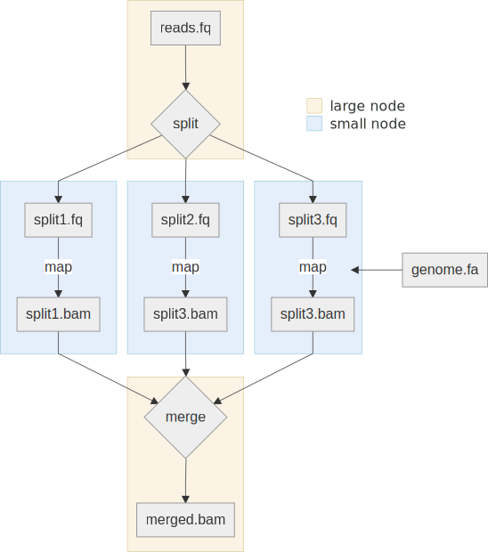

#  Vapormap

Vapormap is a cloud-based alignment pipeline for Hi-C. Each fastq file is split into a number of chunks which are all aligned in parallel on aws batch. Jobs are managed using nextflow. The pipeline has 4 profiles:
* standard: Run the pipeline on the local machine directly.
* docker: Run the pipeline on the local machine inside a docker container (requires docker).
* singularity: Run the pipeline on the local machine inside a singularity container (requires singularity).
* aws: Runs the pipeline on aws batch.
* pasteur: Profile specific to institut Pasteur's HPC, to run the pipeline via singularity in a SLURM.



Hi-C reads can be aligned using iterative mapping. All configuration is done through `nextflow.config`. When using the aws profile, you need to set the input path on a s3 bucket (e.g. "s3://dir/input/").

### Prerequisites

sdk should be installed and configured for your account. A bucket with input files should also be online.


### Installation

You can get nextflow with the following command:

```bash
wget -qO- https://get.nextflow.io | bash
```

### Usage

First, edit the parameters and paths in `nextflow.config`. Then run the pipeline using:

```bash
./nextflow run main.nf -profile docker
```
Where the profile can be any of {docker,singularity,aws,pasteur}.

